# AI City — v3

A living city for Roblox. It holds 90 citizens, each with a name, a face, a family, a personality, a job or a school, a daily routine, friends, opinions and a memory. They wake up, walk to work along the sidewalks, sit at their desks on the 12th floor, bake bread at 5 AM, lift weights at the gym, play soccer after school, gossip on the plaza, have babies and grow up.

Players can talk to anyone, give speeches, run for mayor and pass laws. They can also commit crimes, but anyone who sees it will call the police.

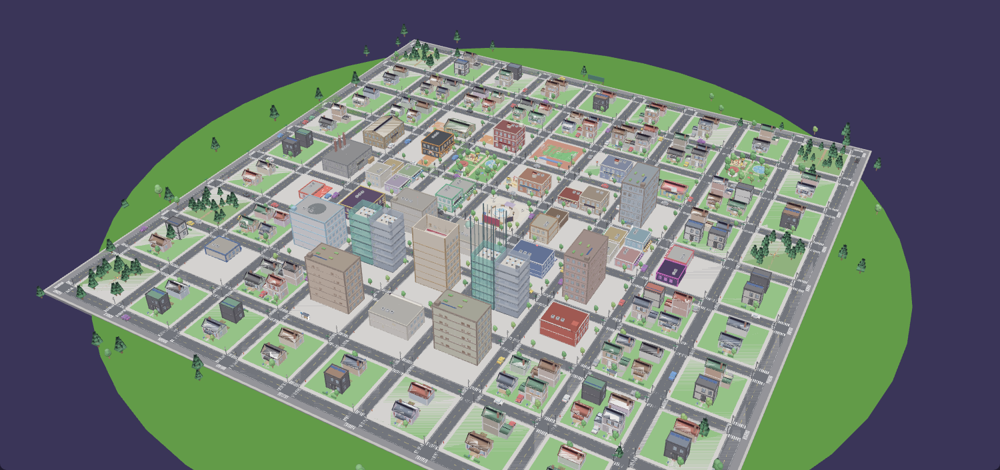

## Open it

- **Roblox Studio:** open `AICity.rbxlx` and press **Play**. The city builds itself in a few seconds and everyone walks to where their day takes them.
- **Rojo:** run `rojo serve` in this folder (see `default.project.json`).
- **Saving:** citizens, families, memories, the mayor and players' coins are saved with DataStores once the place is published (turn on *Studio Access to API Services* to test saving in Studio). Without access the game still runs; it just doesn't save.

## What's new in v3

| | |
|---|---|
| 🗺️ **A bigger, more detailed city** | 9×9 blocks (about 900 studs across) and 46 places, including office towers 12–16 floors tall. It also has a lake with a pier, hills, mountains, forests, traffic lights, crosswalks, bus stops and 70 parked cars. |
| 🏢 **Real insides** | Every building is furnished: <ul><li>the gym has treadmills, dumbbells, a squat rack, punching bags and yoga mats;</li><li>the offices have desk rows with elevators to every floor;</li><li>there are classrooms, hospital beds, a cinema with rows of seats, a bank vault, a police holding cell, and a kitchen in the restaurant.</li></ul> |
| 🏫 **Three schools and a daycare** | Kids go to the right school for their age: elementary 6–10, middle 11–13, high 14–17. Toddlers go to daycare while their parents work. |
| 🙂 **Faces** | Drawn faces with 14 expressions. People blink, look at you when you come close, and move their mouths when they talk. |
| 👕 **Looks and sizes** | Casual outfits (hoodies, jackets, stripes, dresses, overalls), beards, earrings, hair bows and sneakers. Everyone has their own height, and kids have bigger heads for their size. |
| 💃 **Body language** | 50+ poses: typing, cooking, kneading dough, teaching at the board, curling dumbbells, squatting, running on the treadmill, yoga, reading, eating, sleeping, fishing, dancing, swinging, shooting hoops... Each comes with props: cups, books, dumbbells, fishing rods, phones and more. |
| 🧠 **Personalities and a social life** | Ten personalities change how people walk, talk, spend free time and react. Friends wave on the street, stop to chat and pass on gossip about players. |
| 🚶 **Natural movement** | Everyone has their own pace and keeps to their own side of the sidewalk. They stop to check their phone, kids run ahead, and people hurry when they're late. |
| ⚽ **After-school life** | Real soccer games (two teams, a ball, goals, cheering), shooting hoops, swings, the arcade, homework at the library, and weekend family outings. |
| 💬 **Dialogue** | Talk to anyone. Answers depend on their personality, mood, job, the city and what they remember about you. |
| 🗳️ **Politics** | Speeches, elections with citizen candidates, votes, a mayor's salary and daily policies. |
| ⚔️ **Fighting and crime** | Fists, a bat, a hammer and a knife, with attack animations, blocking, and citizens who fight back. Also pickpocketing and robberies. Witnesses need line of sight. Wanted stars bring police chases with backup, and getting caught means jail and a fine. |
| 🖥️ **A full interface** | <ul><li>HUD: clock, city mood, rotating minimap, coins, wanted stars, a news ticker and a health bar that glows red when you're hurt.</li><li>📱 **A phone** (**Tab**) with every app: map, people, news, vote, goals, speech, mayor, help and settings.</li><li>🎯 **Daily goals**: four new ones every day, such as "chat with 3 citizens" or "visit Mirror Lake". Each pays coins.</li><li>A weapon hotbar with a cooldown sweep, a **target card** for whoever you're facing (name, job, health), and health bars over people who are hurt.</li><li>A camera flyover behind the welcome screen.</li><li>Windows: a city map, a people directory, profile cards with a 3D portrait, voting, speeches, the mayor's desk, conversations, elevators, the weapons shop, help and settings.</li></ul> |

## The city

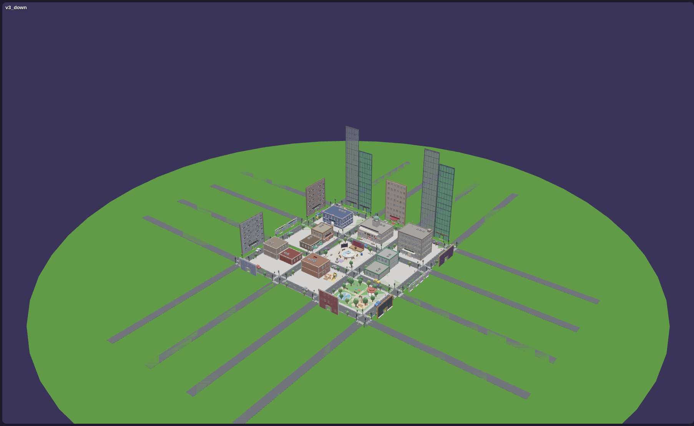

| Area | What's there |
|---|---|
| **Downtown** | <ul><li>⛲ City Plaza: fountain, speech stage and podium, ballot box, news board, chess tables, dance floor, musicians.</li><li>🏛️ Town Hall and 🏦 City Bank (vault and ATM).</li><li>🚓 Police (holding cell), 🥐 Bakery, ☕ Cafe, 🛒 Market, 💊 Pharmacy, 📚 Library, 🍝 Restaurant.</li></ul> |
| **Around downtown** | <ul><li>🏢 Two office blocks with glass towers 12–16 floors tall.</li><li>🏨 Grand Hotel, 🏥 Hospital (helipad), 🚒 Fire Station, 🎬 Cinema, 🏋️ Gym (with a basketball court).</li><li>🏺 City Museum (a dinosaur!), 📮 Post Office, 🕹️ Arcade and 🍔 Diner, 🤝 Community Center.</li><li>Two shopping streets: 👕 🧸 📱 💐 🐶 📖 🍦 🔨.</li><li>Two apartment buildings (6 floors, with elevators).</li></ul> |
| **Schools and parks** | <ul><li>🏫 Elementary (playground), 🏫 Middle School (basketball hoop), 🎓 High School (3 floors, court) and 🧸 Daycare.</li><li>⚽ Sports Field (bleachers, floodlights, running track).</li><li>🌳 Central Park and 🌿 Willow Park (ponds, gazebos, gardens, easels, jogging loops).</li></ul> |
| **Edges** | <ul><li>Houses and suburbs, each with a street address like "12 Oak Street". Styles are cottages, two-story houses with garages, modern houses and bungalows, all with porches and mailboxes.</li><li>🏭 Factory, 📦 Warehouse, ⛽ Gas & Garage.</li><li>🌲 Woods, and 🎣 Mirror Lake with a fishing pier.</li></ul> |

Inside the buildings:

| Gym | Offices (a floor of a tower) | Elementary school |
|---|---|---|
| 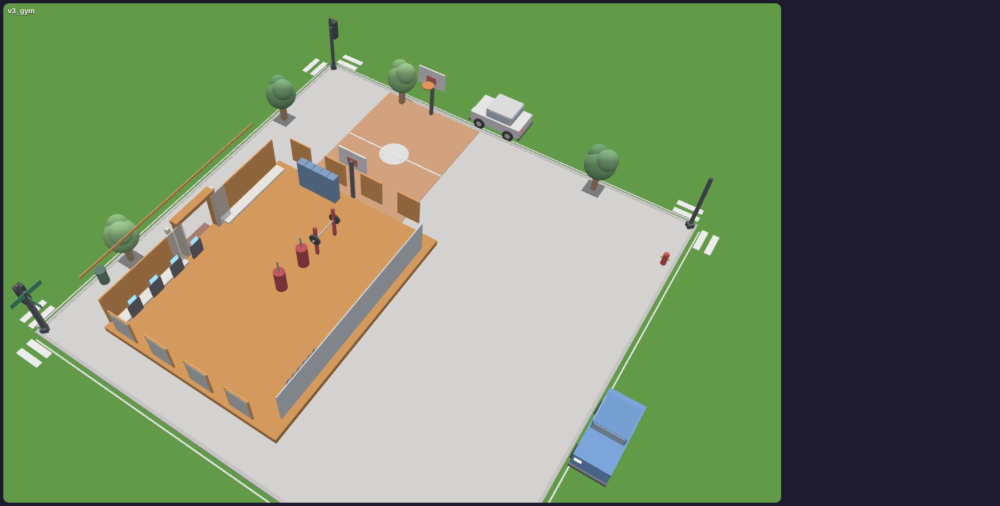 | 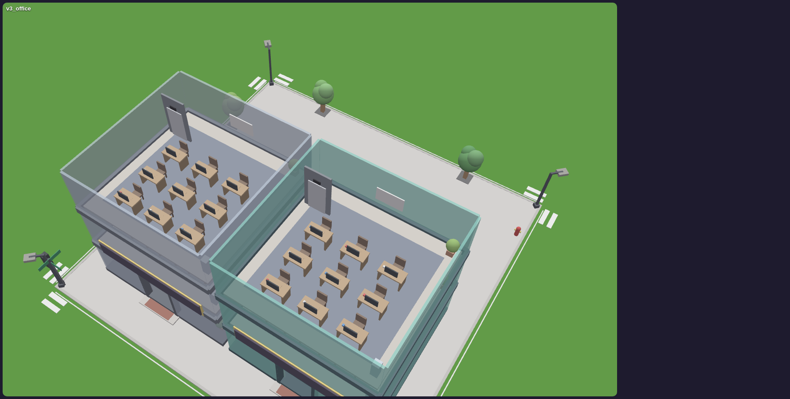 | 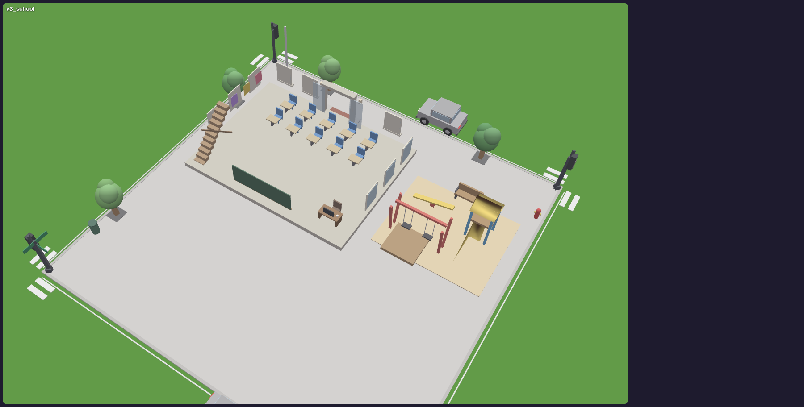 |

Street lamps, windows, porch lights, neon signs and stadium floodlights switch on at dusk. The sky runs through dawn, morning, noon, golden hour, sunset and night (see `Atmosphere`).

## The citizens

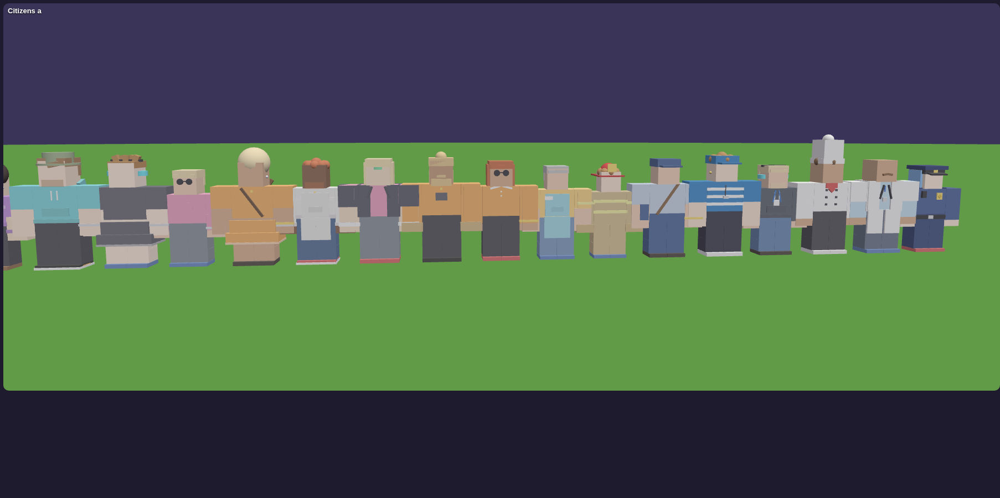
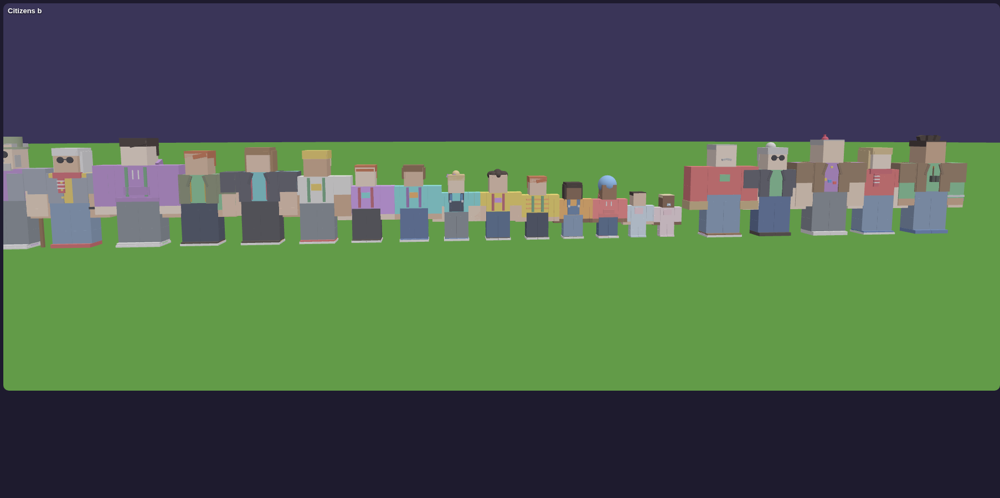

- **Faces:**
  - eyes with irises, pupils and a shine;
  - eyebrows, lashes, freckles, blush and wrinkles;
  - a mouth that smiles, frowns, grins, laughs, gasps, wobbles when scared and moves while talking.

  Every player's screen animates the blinking and glancing, so the server doesn't have to.

  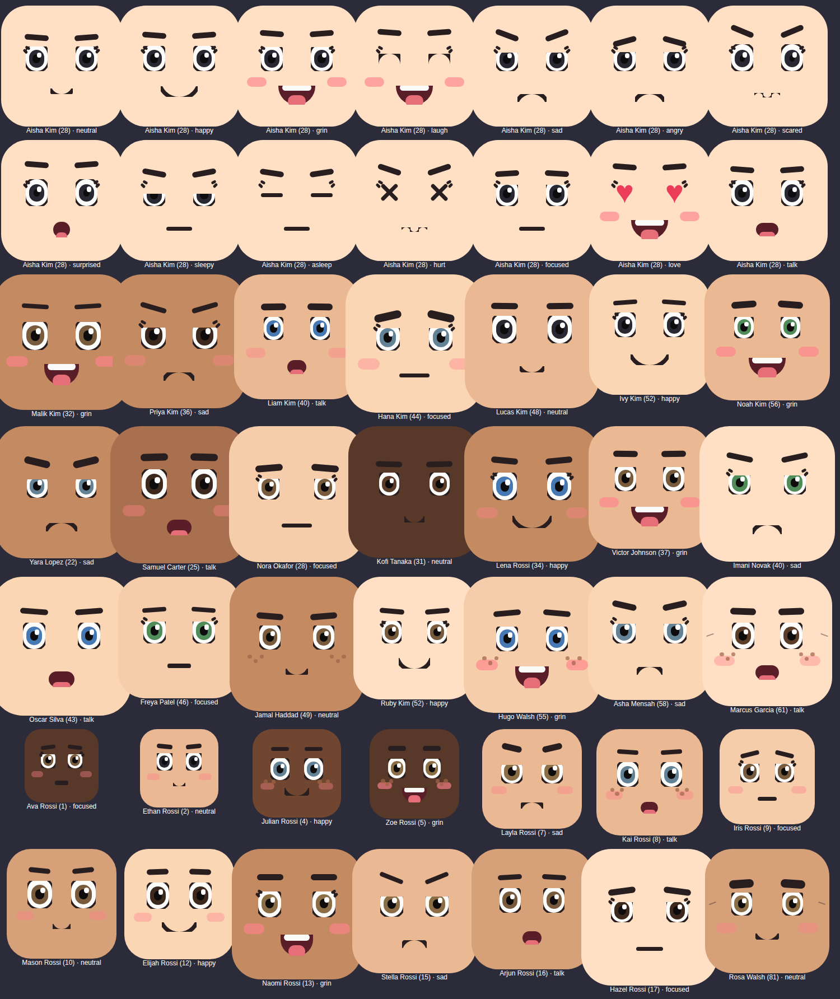
- **Looks:**
  - every job has a uniform (police caps, doctors' coats, chefs' hats, hard hats, the coach's whistle, the mail carrier's bag...);
  - off duty, people wear their own outfits;
  - hobbies show too: a painter's beret, a gamer's headphones.
- **Sizes:**
  - babies are tiny and grow steadily year by year;
  - two 8-year-olds aren't the same height;
  - adults vary from short to tall.
- **Personalities:** cheerful, shy, grumpy, chatty, bookish, sporty, artsy, curious, calm or funny. This changes:
  - how fast they walk and how often they chat;
  - what they say;
  - what they do after work (sporty people go to the gym);
  - how they react to you.
- **Values:** what they care about in politics (wealth, community, safety, freedom, nature, tradition). This decides how they react to speeches and who they vote for.
- **Friends:** classmates, coworkers and people their age. Friends wave and say hi on the street, stop to chat and pass on gossip.

### A day in AI City

| Time | Who's where |
|---|---|
| 5 AM | Bakers are already kneading dough. Everyone else is asleep. |
| 7–9 AM | Breakfast, a morning jog, then the rush hour: commuters head to the towers and kids walk to their school. |
| 9 AM–5 PM | Offices full, classes on, recess and lunch on the playgrounds, lunch breaks at the cafe, toddlers at daycare, retirees fishing at the lake, playing chess and napping. |
| 3–5:30 PM | After school: soccer on the sports field, hoops, swings, the arcade, homework at the library. |
| Evening | The gym, hobbies, friends at the diner, family dinner at home, date night at the restaurant or cinema, dancing on the plaza. |
| Night | Kids in bed at 8, adults by 10–11. Night officers and the night janitor work until midnight. |
| Weekends | Offices, banks and schools are closed. Saturday soccer, family outings (the park, the lake, the museum, a movie, ice cream), shopping, nights out. |

- **Families and babies:** couples start expecting (their nameplates show "🍼 2 days"). On the due day they walk to the hospital, the baby is born, the whole city hears about it, and the family goes home.
- **Growing up:** people age with `DAYS_PER_YEAR`. Kids move up from daycare through elementary, middle and high school, get a job at 18 and retire at 67.

## Things to do

| | |
|---|---|
| 💬 **Talk** | Walk up to anyone and press **E**. Ask about their day, their job, the city, the mayor or the gossip. You can also tell a joke, give a compliment or a gift, ask for directions (they mark it on your screen), ask them to walk with you, or insult them. They remember everything, and they tell their friends. |
| 🎤 **Give a speech** | Stand at the plaza podium and press **B**. Pick up to 2 ideas. Listeners cheer or boo depending on their values, and you're now running for mayor. |
| 🗳️ **Vote** | Press **V**. Elections happen every `ELECTION_INTERVAL`. Citizens vote for whoever shares their values and whoever they like. |
| 🏛️ **Be the mayor** | The winner gets a salary and passes one policy a day (**N**), which changes the economy, safety and happiness. |
| 🎯 **Daily goals** | Four goals every day, shown under the clock (click the title to fold them). Examples: talk to people, give a gift, make a friend, visit places, go up a tower, give a speech, vote. Each one pays coins when you finish it. |
| 🗺️ **Explore** | **M** opens the city map: search places, see what's open and who's inside, and set a waypoint. **P** opens the People directory: find anyone, see their card, or follow a waypoint to them. Press **E** at elevator doors to ride the towers. |

## Crime and punishment

- ⚔️ **Fighting:** attack with **F** (or click while holding a weapon), and **hold X** to block, which cuts the damage you take to a third.
  - Your attack animation matches what you're holding: quick jabs with fists, heavy swings with a bat or hammer, a lunge with a knife.
  - People you hit flinch and get knocked back. Most run away screaming, but tough citizens (grumpy and sporty people) and the police **fight back** and can hurt you. Your ❤️ health bar is at the bottom left.
  - When someone's health runs out they go 💀 **down**: they collapse, see stars, and the paramedics take them to a hospital bed. There's no blood (Roblox rules), and the city's families stay intact.
  - If **you** get knocked out, you wake up at the hospital. Your wanted stars are cleared, but there's a hospital bill.
  - You can also fight other players.
- 🔪 **Weapons:** buy them at the 🔨 **Hardware store** (press E at the counter). They go in your hotbar, and you keep them between visits.

  | Weapon | Price | Damage | Notes |
  |---|---|---|---|
  | 👊 Fists | free | 25 | Four punches to put someone down. |
  | 🏏 Baseball Bat | 40 | 40 | Slow, and sends people flying. |
  | 🔨 Hammer | 75 | 45 | Fast and hard, and smashes registers and the vault for 50% more cash. |
  | 🔪 Knife | 120 | 55 | Two stabs and they're down. The most serious crime: extra stars and notoriety. |

  Citizens have 100 health, police 150 and SWAT 250. **The police confiscate your weapons when they arrest you.**
- 🫳 **Pickpocket:** hold **G** next to someone. Facing them makes it more likely they'll notice.
- 💰 **Rob a register or the bank vault:** hold **R**. The bank has a silent alarm.
- **Witnesses** need to see it happen (walls block their view), or be very close. They scream, run and remember it, tell everyone, and call the police.
- **Wanted stars ⭐: the more crime, the harder they come.** Every crime someone sees adds stars. A crime committed right in front of the police adds an extra one.

  | Stars | Who comes after you | How hard |
  |---|---|---|
  | ⭐ | 2 officers | They run at 17 and see 85 studs. |
  | ⭐⭐ | 3 officers | They're faster, see farther and search a wider area. |
  | ⭐⭐⭐ | 5 officers, from anywhere in the city | They run at 20, backup arrives every 5 s, and the stars take longer to fade. |
  | ⭐⭐⭐⭐ | 7, half of them SWAT (helmets, armor, harder to knock out) | They check hiding spots more often. |
  | ⭐⭐⭐⭐⭐ | 10 with SWAT, plus a 🚁 police helicopter | The helicopter circles where you were last seen, and its searchlight spots you from the sky unless you're indoors or hidden. |

- **Notoriety 🔥:** every crime makes the police remember your face. Repeat offenders start at a higher wanted level and take longer to lose. Notoriety slowly cools off while you stay out of trouble, and it's saved between visits. The HUD shows "🔥 Known to the police", then "The police know your face", then "Most wanted in the city".
- **Losing them:** the police only know where they **last saw** you, and your HUD shows "🚨 CHASING", "🔎 SEARCHING" or "🫥 HIDDEN".
  - Break their line of sight by ducking around a corner or into a building. They run to where they last saw you and search the area, checking nearby hiding spots.
  - **Hide** in one of about 150 hiding spots: trash cans downtown, hedges in front of houses, and bushes in the parks. Hold **Q** next to one and you vanish inside, so the police can't see you. An officer searching right next to your spot might still check it, and if one **saw you climb in**, they'll come straight for it.
  - Stay out of sight and your stars fade one by one, faster while you hide. Press **Space** (or **Q**) to get out.
- **BUSTED:** a fine and time in the police station's jail cell.
- **Kids and babies can't be hurt.**

## The screen

| HUD: goals, target card, hotbar | The phone (Tab) |
|---|---|
| 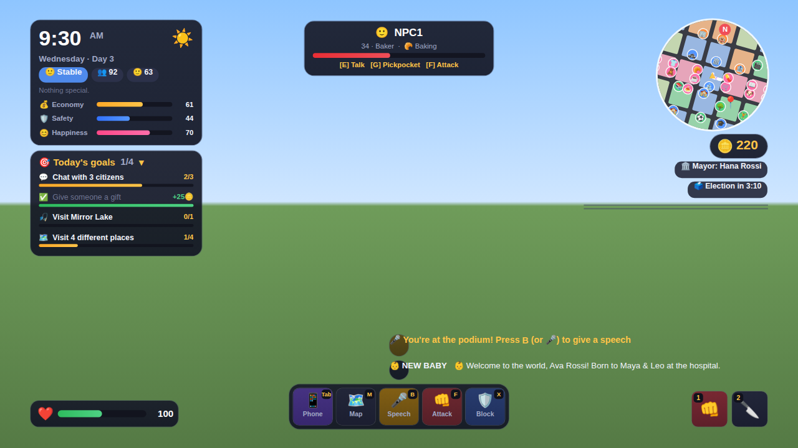 | 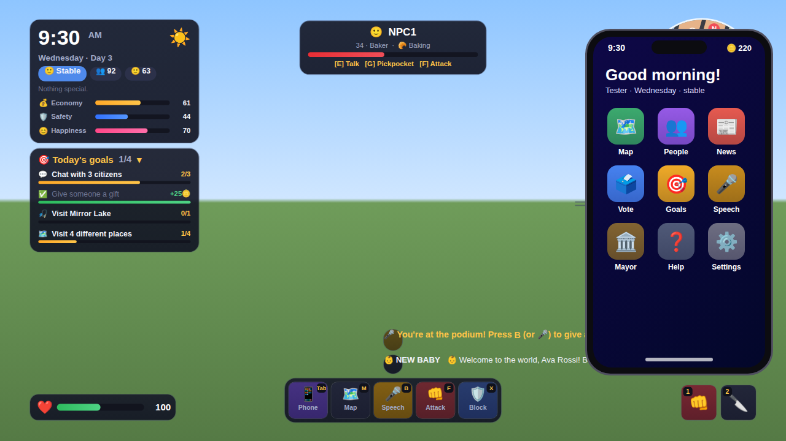 |
| **Talking to someone** | **Weapons shop** |
| 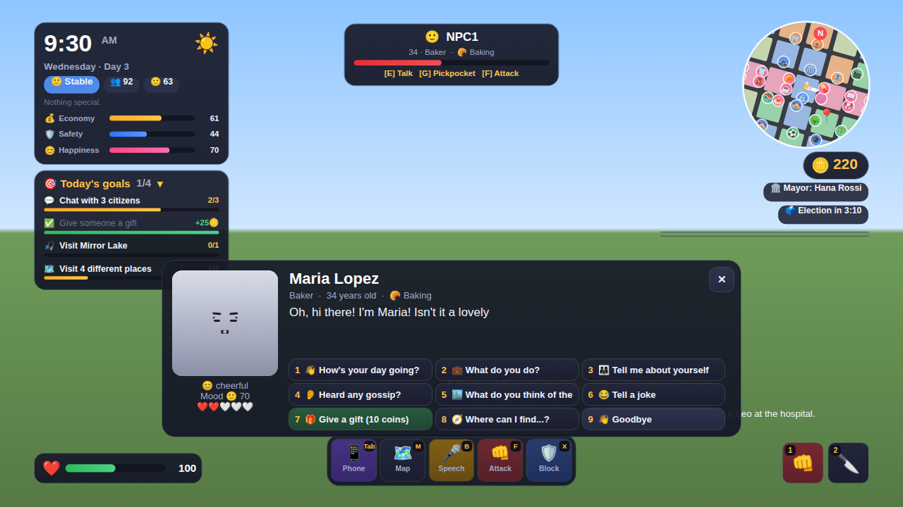 | 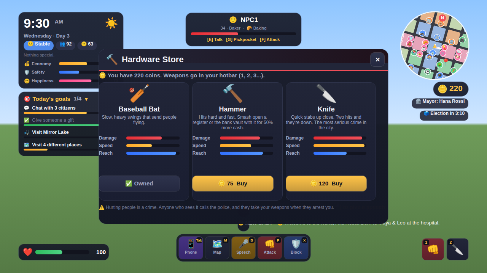 |
| **Citizen card** | **City map** |
| 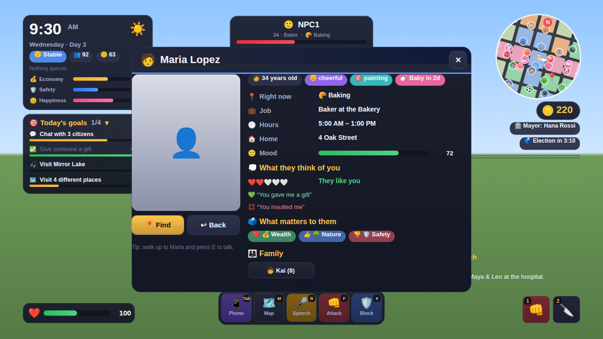 | 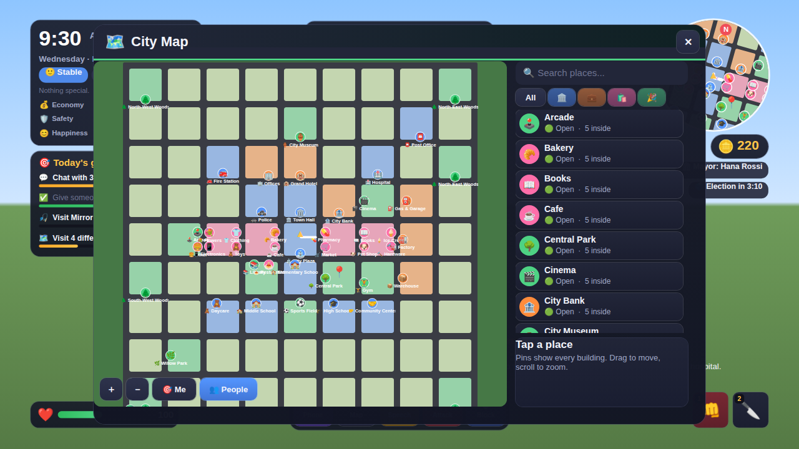 |

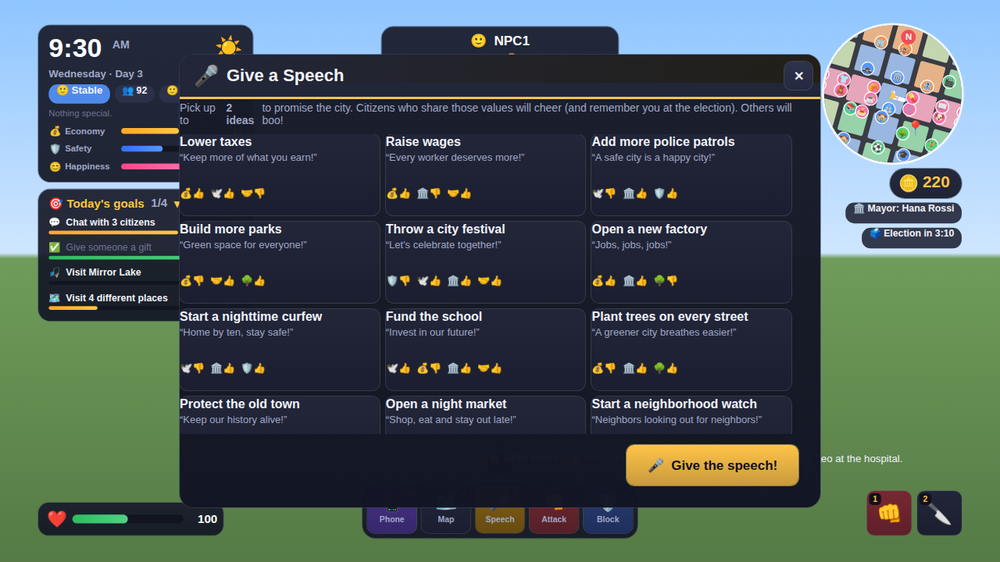

*(These previews were drawn from the game's real UI in a test harness. In Roblox, the portraits show the 3D citizen.)*

| Key | |
|---|---|
| Tab | phone (all the apps) |
| E | talk / use elevator |
| M | map |
| P | people |
| V | vote |
| B | speech |
| N | mayor's desk |
| F | attack (or click with a weapon) |
| X | block (hold) |
| 1–4 | hotbar: 1 = fists, then your weapons |
| G | pickpocket |
| R | rob |
| Q | hide (at trash cans, hedges and bushes) · Space gets out |
| H | help |
| 1–9 | answer in conversations |
| Esc | close |

Every action is also a button on the action bar for mobile players.

## How it works

| Script | Where | What it does |
|---|---|---|
| `Main` | ServerScriptService | Builds the map, loads or creates the citizens, starts everything. |
| `MapBuilder` + `MapKit`, `Buildings`, `Interiors`, `Streets`, `Landscape`, `Places` | Modules | The city, its interiors and the "spots" where people stand, sit, work and sleep. |
| `Life` | Modules | Who lives here: families, ages, jobs, schools, personalities, friends, and where each person should be at any hour. Pure logic, no parts. |
| `CityService` | Modules | Clock and calendar, city stats and mood, mayor, elections, speeches, policies, coins, memories, gossip, news, saving, and the remotes. |
| `CitizenService` | Modules | The NPC bodies: walking, elevators, spots, soccer, chatting, greetings, reactions, knockouts, births, growing up. |
| `DialogueService` | Modules | Conversations with players, and citizens' small talk. |
| `CrimeService` | Modules | Fighting (attacks, citizens fighting back), crimes, witnesses, wanted stars, police chases, SWAT, the helicopter, hiding, jail. |
| `CombatService` | Modules | Weapons as tools, the Hardware store shop, blocking, waking up at the hospital, confiscation. |
| `PlayerService` | Modules | Elevators, profiles, the directory, finding people. |
| `CitizenLook` | Modules | Outfits, hair, items, faces and sizes. |
| `Config`, `Actions`, `Atmosphere`, `Faces`, `Poses`, `Weapons` | ReplicatedStorage.Shared | Settings; the list of actions; the sky; drawn faces; the pose and prop library; weapon stats. |
| `CityClient` (+ `UI`, `Hud`, `Panels`, `World`) | StarterPlayerScripts | Everything on screen, and the citizens' body language, faces, nameplates and speech bubbles. |

It's built to stay light on the server:
- **The server only decides where people are and what they're doing.** Each citizen carries this in their `Action`, `Expression` and `Activity` attributes.
- **Each player's own client handles the look.** It plays the poses, adds the props, blinks the faces and turns heads toward you, but only for people near the camera.
- **Nobody walks where nobody can see.** People near a player walk at `WALK_SPEED`, people further out at `TRAVEL_SPEED`. People and waypoints that are far from every player (over 2× `WATCH_RADIUS`) hop along their route instead of walking it, so cross-town trips still fit the day.
- **Crowds don't jam.** Citizens don't collide with each other.
- **Only nearby houses are furnished.** A house is furnished the first time a family moves in.
- **The place uses `StreamingEnabled`,** and citizens stream in whole.

### For your own scripts

```lua
local Modules = game.ServerScriptService.Modules
local map = require(Modules.MapBuilder).Build()          -- builds once, then returns the same map
map.Places.Bakery.Door, map.Places.Bakery.Inside, map.Places.Bakery.Spots
map.Homes[1].Address, map.Route(fromPos, toPos), map.RouteBetween(placeA, placeB)

local CityService = require(Modules.CityService)
CityService.Event.Event:Connect(function(kind, ...)      -- "NewDay", "Born", "Expecting", "GrewUp",
	print(kind, ...)                                     -- "Retired", "Crime", "Speech", "Election",
end)                                                     -- "Policy", "News"
CityService.News("Something happened!")                 -- the news board, ticker and toasts
CityService.AddCoins(player, 50, "🎁 Reward")
CityService.Remember(citizen, player, "helped me", 10, "helped Maria")   -- memories and opinions
```

Set `Config.RUN_CITIZENS = false` if your own scripts spawn citizens; the map and `CityService` still run. To change what's built where, edit `PLAN` in `MapBuilder.lua`: each block (`"i,j"`, the plaza is `"0,0"`) names what goes there.

## Config

Your Config is the base. Every key you had is still there, and these were added:

| Key | What it does |
|---|---|
| `Config.Schools` | The three schools and the ages that go to each. |
| `DAYCARE_AGE` | Toddlers from this age go to daycare while their parents work. |
| 12 new jobs | Middle and high school teachers, coach, daycare worker, museum guide, mail carrier, arcade attendant, cook, programmer, accountant, night janitor, community organizer. |
| 10 new places | Middle School, High School, Daycare, Museum, Post Office, Arcade, Diner, Community Center, Willow Park, Mirror Lake. |
| `WEEKENDS` (optional) | Set to `false` to turn off weekends. |
| `RUN_CITIZENS`, `SAVE_POPULATION` (optional) | Both default to on. |

## Tested

The game was run in a Luau test harness (a small Roblox simulation), and these checks pass:

- **The map:**
  - every job and school has enough spots;
  - every upper floor can be reached;
  - no buildings overlap and nothing sticks into the roads;
  - every place can be walked to.
- **Two full simulated days:**
  - up to 45 people at work at once;
  - kids at the right schools;
  - soccer after school;
  - 160+ speech bubbles;
  - 45 different actions;
  - nobody out walking at 2 AM.
- **A player's session, start to finish:**
  - a speech;
  - a conversation covering every topic, plus a gift and directions;
  - daily goals completing and paying out;
  - a profile card, the directory and the places list;
  - four punches, a knockout, a witness and wanted stars;
  - a police chase, an arrest, jail and release;
  - running out of sight (the police search where they last saw you), hiding in a trash can until the stars fade, and getting found after being seen climbing in;
  - buying weapons, stabbing someone down in two hits, a grumpy citizen fighting back (blocking takes a third of the damage), getting knocked out and waking up at the hospital, hitting another player with a bat, and the police confiscating the weapons at the arrest;
  - six crimes in a row: 2 stars and 3 officers, then 4 stars with SWAT, then 5 stars with 10 police, SWAT and the helicopter;
  - an elevator ride to floor 9;
  - a vote and an election (and winning it).
- **The client:** every window and every server message, and poses on 20 citizens at once.
