# AI City — v3

A living city for Roblox. It holds 90 citizens, each with a name, a face, a family, a personality, a job or a school, a daily routine, friends, opinions and a memory. They wake up, walk to work along the sidewalks, sit at their desks on the 12th floor, bake bread at 5 AM, lift weights at the gym, play soccer after school, gossip on the plaza, have babies and grow up.

Players can talk to anyone, give speeches, run for mayor and pass laws. They can also commit crimes, but anyone who sees it will call the police.


## Open it

- **Roblox Studio:** open `AICity.rbxlx` and press **Play**. The city builds itself in a few seconds and everyone walks to where their day takes them.
- **Rojo:** run `rojo serve` in this folder (see `default.project.json`).
- **Saving:** citizens, families, memories, the mayor and players' coins are saved with DataStores once the place is published (turn on *Studio Access to API Services* to test saving in Studio). Without access the game still runs; it just doesn't save.

## What's new in v3

| | |
|---|---|
| 🗺️ **A bigger, more detailed city** | 11×11 blocks (about 1,100 studs across) and 52 places, including office towers 12–16 floors tall. It also has a lake with a pier, hills, mountains, forests, traffic lights, crosswalks, bus stops and 70 parked cars. |
| 🏠 **Real homes** | Houses are bigger (28–32 studs wide, suburban houses about 20% bigger again) and fully furnished: a living room with a sofa, armchair, TV and speakers, a dining table for four, a kitchen with sink, stove, oven, fridge, microwave and cupboards, a bathroom with a bathtub, toilet, sink and mirror, bedrooms with double beds, a wardrobe, a dresser and a kid's desk. Empty houses get their furniture as you walk up, and **you can walk up the stairs** of two-storey houses (the upstairs floor has a real stairwell with a railing). |
| 🏢 **Real insides** | Every building is furnished: <ul><li>the gym has treadmills, dumbbells, a squat rack, punching bags and yoga mats;</li><li>the offices have desk rows with elevators to every floor;</li><li>there are classrooms, hospital beds, a cinema with rows of seats, a bank vault, a police holding cell with bars, a bench and a toilet, and a kitchen in the restaurant;</li><li>every room is dressed: baseboards and chair rails, framed paintings, wall clocks, plants, trash bins and lighting to match (pendant lamps in the cafe and restaurant, chandeliers in the bank, hotel and town hall);</li><li>every shop looks like what it sells: open shelves stocked with its own goods, clothes racks and mannequins, toy piles and a giant teddy, TVs on the wall, flower buckets, fish tanks and pet cages, a tool wall, an ice-cream freezer and drink fridges.</li></ul> |
| 💼 **Jobs for you** | Clock in as a mail carrier, gardener, barista, janitor, warehouse worker or shelf stocker (the **Jobs** app on your phone, or **J** at the workplace). Follow the glowing marker, hold **E** at each task, and get paid per task plus a bonus for the whole shift. Your character does the work: posting letters, watering, mopping, carrying boxes, making coffee. |
| 🎯 **Citizens with a purpose** | People don't just wander. A shopping trip means browsing the shelves, paying at the till, walking home with a bag and unpacking it in the kitchen. Mail carriers go house to house, gardeners water and rake the park, the police patrol, waiters carry plates to tables, clerks restock shelves from the stockroom, and the night janitor mops the offices. On the way to work people carry briefcases, kids wear backpacks, and gym-goers carry gym bags. |
| 🎮 **Controllers** | Full gamepad support (Xbox, PlayStation): R2 attack, L2 block, L3 sprint, R1 / L1 weapons, the D-pad for the phone, map, help and wardrobe, B to go back. Menus can be driven with the D-pad and A, the on-screen hints switch to controller buttons, and the controller rumbles when hits land. |
| 🏫 **Three schools and a daycare** | Kids go to the right school for their age: elementary 6–10, middle 11–13, high 14–17. Toddlers go to daycare while their parents work. |
| 🙂 **Faces** | Drawn faces with 14 expressions. People blink, look at you when you come close, and move their mouths when they talk. |
| 👕 **Looks and sizes** | Casual outfits (hoodies, jackets, stripes, dresses, overalls), beards, earrings, hair bows and sneakers. Everyone has their own height, and kids have bigger heads for their size. |
| 💃 **Body language** | 50+ poses: typing, cooking, kneading dough, teaching at the board, curling dumbbells, squatting, running on the treadmill, yoga, reading, eating, sleeping, fishing, dancing, swinging, shooting hoops... Each comes with props: cups, books, dumbbells, fishing rods, phones and more. |
| 🧠 **Personalities and a social life** | Twenty personalities (cheerful, shy, grumpy, chatty, bookish, sporty, artsy, curious, calm, funny, brave, anxious, romantic, ambitious, lazy, sarcastic, kind, nosy, adventurous, proud) change how people walk, talk, spend their evenings and react: brave people fight back, anxious people run and stay home, kind people volunteer, romantic people take evening walks by the lake, lazy people lounge on the sofa, nosy people watch the plaza. Friends wave on the street, stop to chat and pass on gossip about players. |
| 🚶 **Natural movement** | Everyone has their own pace and keeps to their own side of the sidewalk. They stop to check their phone, kids run ahead, and people hurry when they're late. People look ahead and step around each other (and around you) instead of walking into you, and wait a moment when the sidewalk is blocked. |
| ⚽ **After-school life** | Real soccer games (two teams, a ball, goals, cheering), shooting hoops, swings, the arcade, homework at the library, and weekend family outings. |
| 💬 **Dialogue** | Talk to anyone. Answers depend on their personality, mood, job, the city and what they remember about you. Conversations go deeper: follow-up questions (*why* they're having a good or bad day, whether they like their job, their dream job, their hobby), and **💭 Let's really talk** for their dreams, fears, advice, favorite food and place, best memory, and what they honestly think of you (they bring up what you actually did). Every personality has its own voice and verbal habits. |
| 🗳️ **Politics** | Speeches, elections with citizen candidates, votes, a mayor's salary and daily policies. |
| ⚔️ **Fighting and crime** | Fists, a bat, a hammer and a knife, with full-body fight animations (a jab-cross-hook-uppercut combo, kicks, hit reactions, staggers, a victory fist pump), weapon moves (bat swings, a two-handed hammer slam, knife stabs and slashes with swing trails), blocking, and citizens who fight back. **No witnesses, no police:** hit someone from behind with nobody watching and they won't know it was you. Strangers get into street fights too, with crowds, phones out and police breaking them up. Pickpockets, bag snatchers, robbers and taggers get chased, handcuffed and locked up, unless you catch them first. Also pickpocketing and robberies. Hoodies, ski masks and disguises make you harder to recognize, especially at night. Witnesses need line of sight. Wanted stars bring police chases with backup, and getting caught means jail and a fine. |
| 🖥️ **A full interface** | <ul><li>HUD: clock, city mood, rotating minimap, coins, wanted stars, a news ticker and a health bar that glows red when you're hurt.</li><li>📱 **A phone** (**Tab**) with every app: map, people, news, vote, goals, speech, mayor, help and settings.</li><li>🎯 **Daily goals**: four new ones every day, such as "chat with 3 citizens" or "visit Mirror Lake". Each pays coins.</li><li>A weapon hotbar with a cooldown sweep, a **target card** for whoever you're facing (name, job, health), and health bars over people who are hurt.</li><li>A camera flyover behind the welcome screen.</li><li>🧍 **Smoother, more human citizens:** Roblox's classic Man and Woman body packages (rounded shoulders and limbs instead of blocks), with the drawn faces kept. If a package can't load, citizens quietly fall back to the default body.</li><li>🌄 **More realistic look:** Roblox's modern materials (real brick, concrete, wood, asphalt and grass textures), crisp sun shadows, reflective lake water with gentle waves, and swaying grass on the hills around the city.</li><li>🌆 **Better graphics:** every room is lit by a grid of soft ceiling lights, nights are brighter with glowing neon, and there are moving clouds, chimney smoke, fireflies over the ponds and falling leaves. Buildings have rounded corners.</li><li>📱 **Plays on phones**: on a touch screen (or a small window) the HUD switches to a compact layout that keeps the joystick and jump button clear, and every window shrinks to fit.</li><li>Name tags stay readable: they're drawn over buildings, hidden when the person is behind a wall, and only the nearest one shows when tags overlap.</li><li>Windows: a city map, a people directory, profile cards with a 3D portrait, voting, speeches, the mayor's desk, conversations, elevators, the weapons shop, help and settings.</li></ul> |

## The city


The city is 11×11 blocks: an outer ring of big suburban lots wraps the old edge, with woods at the corners. Houses are roomier (every style is 4 studs wider and deeper), and families prefer homes closer to downtown so commutes stay short.

The whole city stands on a solid paved base. Every block has raised pavement sidewalks with curbs, the roads have lane lines and crosswalks, and there are lawns only in yards and parks. The terrain grass stays outside the city, and the tall grass blades are switched off, so grass never grows up through the streets or floors.

| Area | What's there |
|---|---|
| **Downtown** | <ul><li>⛲ City Plaza: fountain, speech stage and podium, ballot box, news board, chess tables, dance floor, musicians.</li><li>🏛️ Town Hall and 🏦 City Bank (vault and ATM).</li><li>🚓 Police (holding cell), 🥐 Bakery, ☕ Cafe, 🛒 Market, 💊 Pharmacy, 📚 Library, 🍝 Restaurant.</li></ul> |
| **Around downtown** | <ul><li>🏢 Two office blocks with glass towers 12–16 floors tall.</li><li>🏨 Grand Hotel, 🏥 Hospital (helipad), 🚒 Fire Station, 🎬 Cinema, 🏋️ Gym (with a basketball court).</li><li>🏺 City Museum (a dinosaur!), 📮 Post Office, 🕹️ Arcade and 🍔 Diner, 🤝 Community Center.</li><li>Two shopping streets: 👕 🧸 📱 💐 🐶 📖 🍦 🔨.</li><li>Two apartment buildings (6 floors, with elevators).</li></ul> |
| **Schools and parks** | <ul><li>🏫 Elementary (playground), 🏫 Middle School (basketball hoop), 🎓 High School (3 floors, court) and 🧸 Daycare.</li><li>⚽ Sports Field (bleachers, floodlights, running track).</li><li>🌳 Central Park and 🌿 Willow Park (ponds, gazebos, gardens, easels, jogging loops).</li></ul> |
| **Edges** | <ul><li>Houses and suburbs, each with a street address like "12 Oak Street". Styles are cottages, two-story houses with garages, modern houses and bungalows, all with porches and mailboxes.</li><li>🏭 Factory, 📦 Warehouse, ⛽ Gas & Garage.</li><li>🌲 Woods, and 🎣 Mirror Lake with a fishing pier.</li></ul> |

Inside the buildings:

**Fight moves** (drawn from the real pose code in a test harness):

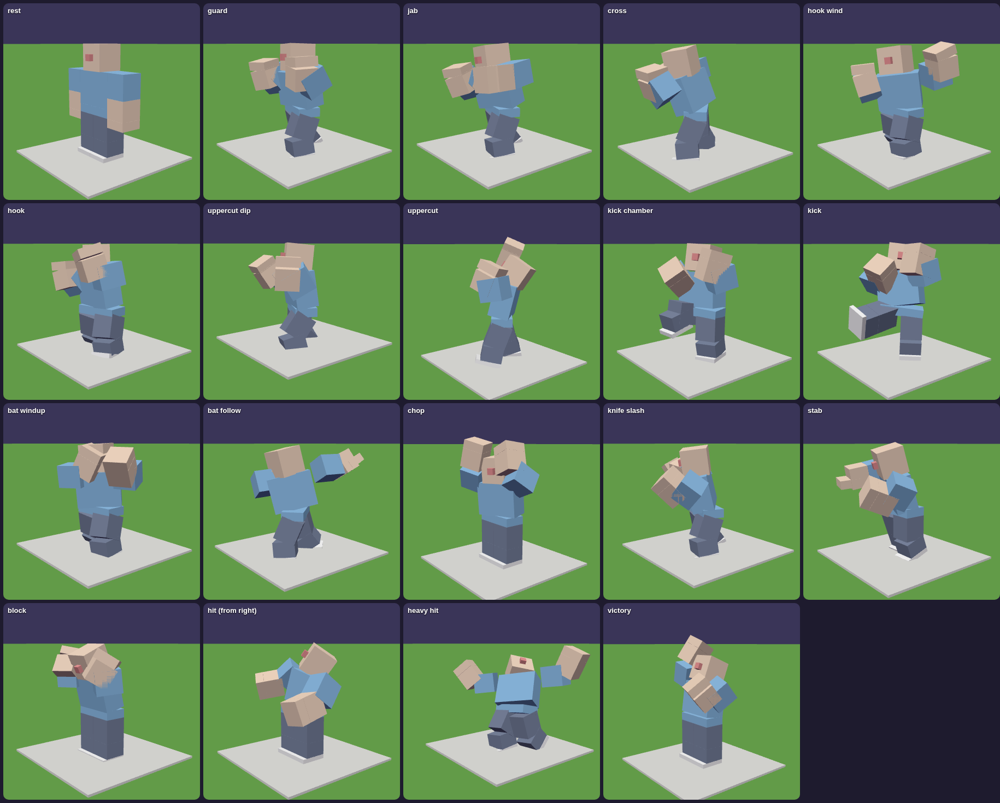

**Weapon moves:**

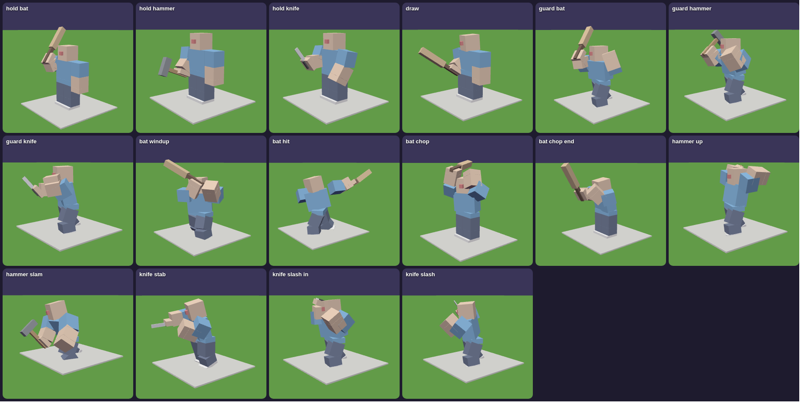

| Gym | Offices (a floor of a tower) | Elementary school |
|---|---|---|
|  |  |  |
| **Toy store** | **Clothing store** | **Restaurant** |
| 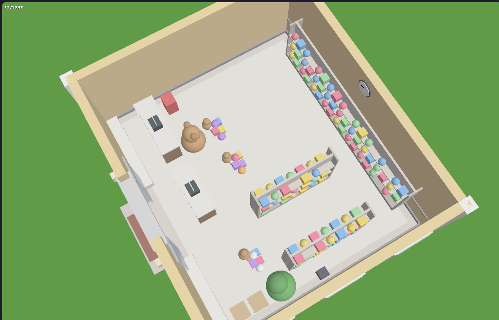 | 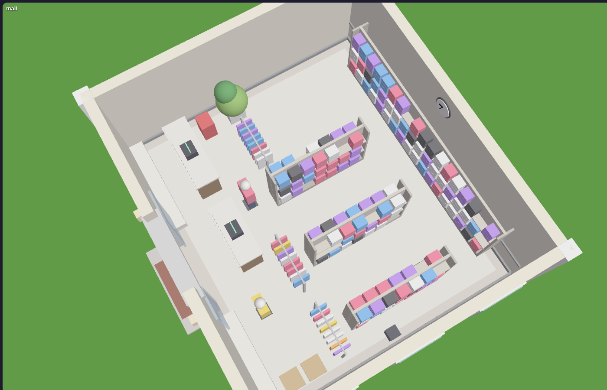 | 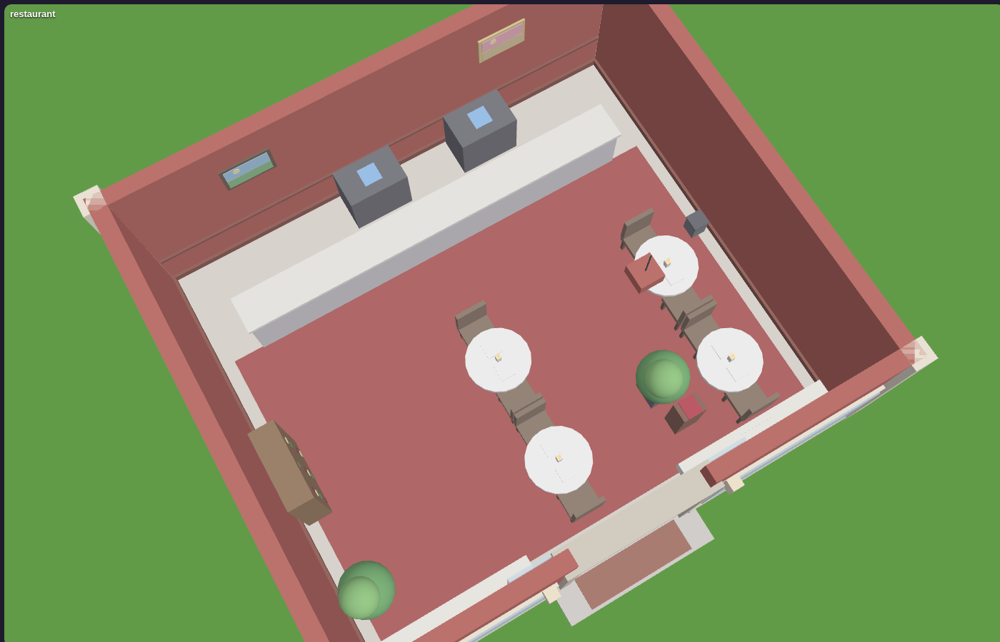 |
| **Cafe** | | |
| 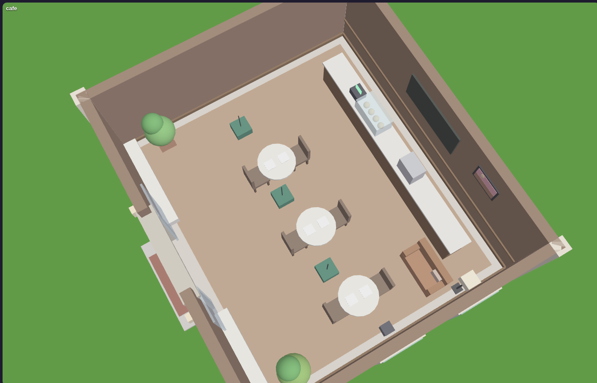 | | |

Street lamps, windows, porch lights, neon signs and stadium floodlights switch on at dusk. The sky runs through dawn, morning, noon, golden hour, sunset and night (see `Atmosphere`).

## The citizens


- **Faces:**
  - eyes with irises, pupils and a shine;
  - eyebrows, lashes, freckles, blush and wrinkles;
  - a mouth that smiles, frowns, grins, laughs, gasps, wobbles when scared and moves while talking.

  Every player's screen animates the blinking and glancing, so the server doesn't have to.

  
- **Looks:**
  - every job has a uniform (police caps, doctors' coats, chefs' hats, hard hats, the coach's whistle, the mail carrier's bag...);
  - off duty, people wear their own outfits;
  - hobbies show too: a painter's beret, a gamer's headphones.
- **Sizes:**
  - babies are tiny and grow steadily year by year;
  - two 8-year-olds aren't the same height;
  - adults vary from short to tall.
- **Personalities:** cheerful, shy, grumpy, chatty, bookish, sporty, artsy, curious, calm or funny. This changes:
  - how fast they walk and how often they chat;
  - what they say;
  - what they do after work (sporty people go to the gym);
  - how they react to you.
- **Values:** what they care about in politics (wealth, community, safety, freedom, nature, tradition). This decides how they react to speeches and who they vote for.
- **Friends:** classmates, coworkers and people their age. Friends wave and say hi on the street, stop to chat and pass on gossip.

### A day in AI City

| Time | Who's where |
|---|---|
| 5 AM | Bakers are already kneading dough. Everyone else is asleep. |
| 7–9 AM | Breakfast, a morning jog, then the rush hour: commuters head to the towers and kids walk to their school. |
| 9 AM–5 PM | Offices full, classes on, recess and lunch on the playgrounds, lunch breaks at the cafe, toddlers at daycare, retirees fishing at the lake, playing chess and napping. |
| 3–5:30 PM | After school: soccer on the sports field, hoops, swings, the arcade, homework at the library. |
| Evening | The gym, hobbies, friends at the diner, family dinner at home, date night at the restaurant or cinema, dancing on the plaza. |
| Night | Kids in bed at 8, adults by 10–11. Night officers and the night janitor work until midnight. |
| Weekends | Offices, banks and schools are closed. Saturday soccer, family outings (the park, the lake, the museum, a movie, ice cream), shopping, nights out. |

- **Families and babies:** couples start expecting (their nameplates show "🍼 2 days"). On the due day they walk to the hospital, the baby is born, the whole city hears about it, and the family goes home.
- **Growing up:** people age with `DAYS_PER_YEAR`. Kids move up from daycare through elementary, middle and high school, get a job at 18 and retire at 67.

## Things to do

| | |
|---|---|
| 💬 **Talk** | Walk up to anyone and press **E**. Ask about their day, their job, the city, the mayor or the gossip. You can also tell a joke, give a compliment or a gift, ask for directions (they mark it on your screen), ask them to walk with you, or insult them. They remember everything, and they tell their friends. |
| 🎤 **Give a speech** | Stand at the plaza podium and press **B**. Pick up to 2 ideas. Listeners cheer or boo depending on their values, and you're now running for mayor. |
| 🗳️ **Vote** | Press **V**. Elections happen every `ELECTION_INTERVAL`. Citizens vote for whoever shares their values and whoever they like. |
| 🏛️ **Be the mayor** | The winner gets a salary and passes one policy a day (**N**), which changes the economy, safety and happiness. |
| 🎯 **Daily goals** | Four goals every day, shown under the clock (click the title to fold them). Examples: talk to people, give a gift, make a friend, visit places, go up a tower, give a speech, vote. Each one pays coins when you finish it. |
| 💼 **Work a shift** | Open **Jobs** on the phone (or press **J** at a workplace). Six jobs: 📬 Mail Carrier, 🌱 Gardener, ☕ Barista, 🧽 Janitor, 📦 Warehouse Worker, 🛒 Shelf Stocker. Follow the marker and hold **E** at each task; a tracker under the clock shows your progress and pay, and you can quit any time. No one hires you while the police are after you. |
| 🗺️ **Explore** | **M** opens the city map: search places, see what's open and who's inside, and set a waypoint. **P** opens the People directory: find anyone, see their card, or follow a waypoint to them. Press **E** at elevator doors to ride the towers. |

## Getting around, getting fit, eating

- 🏃 **Sprinting and stamina:** hold **Shift** (or the Sprint button) to run. Sprinting uses stamina, the ⚡ bar above your health, which refills when you stop (faster if you stand still). Run it empty and you're out of breath for a moment.
- 💪 **Train it:** sprinting earns fitness XP, and so does a proper workout on the **gym treadmills** (press E: you run for a few seconds, +55 XP, full stamina). Every fitness level (up to 20) gives more stamina, faster recovery and a faster sprint. Your level and XP show next to the bar and are saved between visits.

  | Level | Stamina | Sprint speed | Recovery |
  |---|---|---|---|
  | 1 | 100 | 24 | 12.5 / s |
  | 5 | 148 | 26.4 | 18.5 / s |
  | 10 | 208 | 29.4 | 26 / s |
  | 20 | 328 | 35.4 | 41 / s |

- 🍔 **Food:** press **E** at the counter of the Bakery, Cafe, Diner, Restaurant, Ice Cream shop or Market to see the menu. You eat it on the spot (with an eating animation): it heals you ❤️ and refills stamina ⚡. Coffee and energy drinks also make stamina refill faster for a while.

  | Where | Menu |
  |---|---|
  | 🥐 Bakery | Croissant 4, Donut 3, Blueberry Muffin 4 |
  | ☕ Cafe | Coffee 5 (stamina ×1.6 for 90 s), Muffin 4, Croissant 4 |
  | 🍔 Diner | Cheeseburger 10 (+45 ❤️), Fries 5, Milkshake 6 |
  | 🍝 Restaurant | Spaghetti 15 (+70 ❤️), Pizza Slice 8 |
  | 🍦 Ice Cream | Ice Cream 5, Milkshake 6 |
  | 🛒 Market | Apple 2, Sandwich 6, Energy Drink 8 (full stamina, ×2 for 60 s) |

- 🥊 **Fighting moves:** your character puts their fists up and bounces on their feet during a fight, and throws left and right jabs with a body twist. With a weapon, they wind up and chop down with a bat or hammer, or lunge with a knife. Hold X to **block**: both forearms up in front of your face, braced. Citizens in a fight raise their fists and block too.

## Crime and punishment

- ⚔️ **Fighting:** attack with **F** (or click while holding a weapon), and **hold X** to block, which cuts the damage you take to a third.
  - Fists throw a combo: jab, cross, hook, cross, uppercut, with the hips and back foot turning into each punch. Street fighters throw roundhouse kicks too.
  - Weapons have their own moves: the bat alternates a level swing and an overhead chop, the hammer is a two-handed slam, and the knife alternates a stab and a slash. Each swing leaves a trail. You carry each weapon its own way (the bat on your shoulder), pull it out when you equip it, and hold a guard with it in a fight.
  - Getting hit snaps the head away from the punch; heavy hits make you stagger back. Winners do a fist pump.
  - People you hit flinch and get knocked back. Most run away screaming, but tough citizens (grumpy and sporty people) and the police **fight back** and can hurt you. Your ❤️ health bar is at the bottom left.
  - When someone's health runs out they go 💀 **down**: they collapse, see stars, and the paramedics take them to a hospital bed. There's no blood (Roblox rules), and the city's families stay intact.
  - **Witnesses:** the police only come if someone saw it. Bystanders need a clear view (walls block it). The victim only reports you if they saw your face: hit them from behind with nobody around and there are no stars. If they turn round and see you on the next hit, they do call the police.
  - If **you** get knocked out, you wake up at the hospital. Your wanted stars are cleared, but there's a hospital bill.
  - You can also fight other players.
- 🔪 **Weapons:** buy them at the 🔨 **Hardware store** (press E at the counter). They go in your hotbar, and you keep them between visits.

  | Weapon | Price | Damage | Notes |
  |---|---|---|---|
  | 👊 Fists | free | 25 | Four punches to put someone down. |
  | 🏏 Baseball Bat | 40 | 40 | Slow, and sends people flying. |
  | 🔨 Hammer | 75 | 45 | Fast and hard, and smashes registers and the vault for 50% more cash. |
  | 🔪 Knife | 120 | 55 | Two stabs and they're down. The most serious crime: extra stars and notoriety. |

  Citizens have 100 health, police 150 and SWAT 250. **The police confiscate your weapons when they arrest you.**
- 🫳 **Pickpocket:** hold **G** next to someone. Facing them makes it more likely they'll notice.
- 💰 **Rob a register or the bank vault:** hold **R**. The bank has a silent alarm.
- **Witnesses** need to see it happen (walls block their view), or be very close. They scream, run and remember it, tell everyone, and call the police.
- **Wanted stars ⭐: the more crime, the harder they come.** Every crime someone sees adds stars. A crime committed right in front of the police adds an extra one.

  | Stars | Who comes after you | How hard |
  |---|---|---|
  | ⭐ | 2 officers | They run at 17 and see 85 studs. |
  | ⭐⭐ | 3 officers | They're faster, see farther and search a wider area. |
  | ⭐⭐⭐ | 5 officers, from anywhere in the city | They run at 20, backup arrives every 5 s, and the stars take longer to fade. |
  | ⭐⭐⭐⭐ | 7, half of them SWAT (helmets, armor, harder to knock out) | They check hiding spots more often. |
  | ⭐⭐⭐⭐⭐ | 10 with SWAT, plus a 🚁 police helicopter | The helicopter circles where you were last seen, and its searchlight spots you from the sky unless you're indoors or hidden. |

- **Notoriety 🔥:** every crime makes the police remember your face. Repeat offenders start at a higher wanted level and take longer to lose. Notoriety slowly cools off while you stay out of trouble, and it's saved between visits. The HUD shows "🔥 Known to the police", then "The police know your face", then "Most wanted in the city".
- **Losing them:** the police only know where they **last saw** you, and your HUD shows "🚨 CHASING", "🔎 SEARCHING" or "🫥 HIDDEN".
  - Break their line of sight by ducking around a corner or into a building. They run to where they last saw you and search the area, checking nearby hiding spots.
  - **Hide** in one of about 150 hiding spots: trash cans downtown, hedges in front of houses, and bushes in the parks. Hold **Q** next to one and you vanish inside, so the police can't see you. An officer searching right next to your spot might still check it, and if one **saw you climb in**, they'll come straight for it.
  - Stay out of sight and your stars fade one by one, faster while you hide. Press **Space** (or **Q**) to get out.
- 🥷 **Disguises: harder to catch, especially at night.** Buy them at the 👕 **Clothing store** (press E at the counter) and put them on or take them off anytime with **C** (or 📱 Wardrobe). You can wear a top and a face item together, and you keep them between visits.

  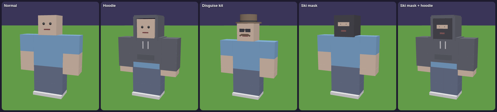

  | Item | Price | Hidden (day / night) | Notes |
  |---|---|---|---|
  | 🧥 Hoodie (top) | 30 | 20% / 45% | Blends in, and in the dark it's hard to tell who's inside. |
  | 🥸 Disguise Kit (face) | 70 | 40% / 50% | A hat, dark glasses and a fake mustache. Looks normal, so nobody gets suspicious. |
  | 🥷 Ski Mask (face) | 55 | 55% / 80% | Hides your face completely, but in daylight people get nervous and the police keep an eye on you. |
  | 🥷 + 🧥 together | | 64% / 90% | The most hidden you can be. |

  What being hidden does:
  - **Witnesses may not recognize you.** In the test, a full outfit at night meant 4 witnesses standing right there recognized you only about 43% of the time (no disguise: 100%). If nobody recognizes you, you get one star fewer, no notoriety, and nobody remembers it was you. The police are looking for "someone in a ski mask and a dark hoodie".
  - **The police have to get closer** to spot you, and bystanders rarely point you out.
  - **Change your look.** Take off or swap your outfit where nobody can see you, and the police keep looking for the old one. They only recognize you up close, and the stars fade about 3 times faster (7 seconds instead of 22+ in the test).
  - The HUD shows how hidden you are right now ("🥷 90% hidden 🌙"), and the police tip tells you when they're looking for your old outfit.
  - The police take your ski mask when they arrest you.
- 👊 **Street fights:** now and then two strangers on the street get into it, and you can watch it happen.
  - It starts with an argument ("Hey! You bumped into me!" / "So what? Watch where YOU'RE going!"), then they square up, circle each other and swing. They land punches, block, and get knocked back, and health bars and hit numbers show over their heads.
  - People walking by stop and form a ring. Some cheer ("Fight! Fight! Fight!"), some film it on their phones, and kids and shy people yell for someone to stop them. Usually somebody calls the police.
  - It ends when someone is knocked out (the ambulance takes them to the hospital), one of them runs for it, they get tired of it, or an officer arrives, breaks it up and walks the one who started it to the station. It makes the news either way.
  - Hold **E** on a fighter to **break it up**: +20 coins, and everyone who saw it likes you more. It's also a daily goal. Or jump in and hit one of them yourself. That's a crime like any other, and they'll turn on you.
  - Grumpy and sporty people and anyone in a bad mood start fights more often, and people who've fought before might go again. Fights happen more at night and when the city's Safety is low. Turn them off with `Config.STREET_FIGHTS = false`, or change how often they happen with `Config.FIGHT_COOLDOWN` (seconds, default 140).
- 🦹 **Other people's crimes, and arrests:** you're not the only criminal in town. Now and then (more at night, and when Safety or the Economy is low) someone near you turns to crime. Sometimes it's a stranger in a dark hoodie and a beanie, sometimes a fed-up local in a bad mood:
  - 🫳 a **pickpocket** sneaks up behind someone and lifts their wallet (sometimes nobody notices);
  - 👜 a **bag snatcher** grabs a bag and runs ("MY BAG!!");
  - 🧾 a **robber** walks into a store: "Hands up! Give me the money!" The alarm goes off and everyone inside runs;
  - 🎨 a **tagger** sprays graffiti on a wall (the city cleans it up the next morning);
  - 💸 ...or **you**: stand still too long and someone might pick *your* pocket.

  When someone shouts **"STOP, THIEF!"**, the police are called and officers chase the thief (their nameplate says 🦹 THIEF). If they catch them, the thief puts their hands up and gets **handcuffed** and walked to the police station, where they sit in the **jail cell** for a while. Go and look: their nameplates say 🔒 IN JAIL. Thieves who get far enough away escape.

  **Catch them yourself:** you get a marker on the thief. Chase them down and hit them (**F**). It's not a crime, so you get no stars. They give up with their hands in the air, the owner gets their things back (or you get your coins back), you get a reward (+30 coins, +60 for a robber), everyone who saw it likes you more, and the police come and take them away. "Catch a thief" is a daily goal too. Street fighters get arrested the same way: whoever started it (sometimes both of them) is cuffed and taken to the cell. Turn it off with `Config.NPC_CRIME = false`, or change how often it happens with `Config.NPC_CRIME_COOLDOWN` (default 110 seconds).
- **BUSTED:** a fine and time in the police station's jail cell.
- **Kids and babies can't be hurt.**

## The screen

| HUD: goals, target card, hotbar | The phone (Tab) |
|---|---|
|  |  |
| **Talking to someone** | **Weapons shop** |
|  |  |
| **Citizen card** | **City map** |
|  |  |

| **Ordering food (E at the counter)** | **On a phone (844×390)** |
| 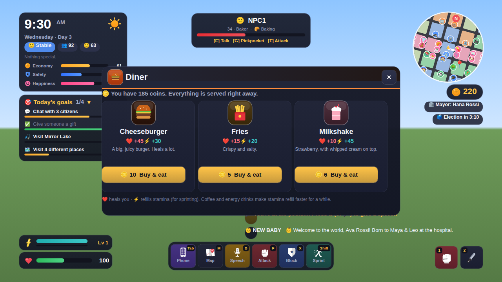 | 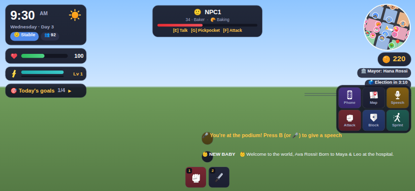 |
| **Wardrobe (C) at the Clothing store** | **Giving a speech** |
| 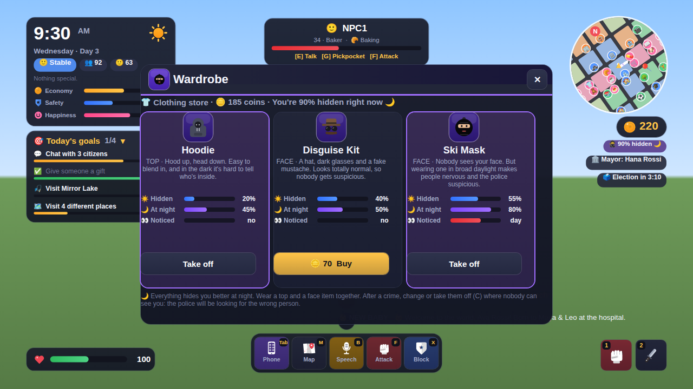 |  |

**Its own icon set.** The HUD, action bar, hotbar, phone apps, window headers, shops and welcome screen use AI City's own icons instead of emojis: 35 vector icons drawn from rounded shapes in `Icons.lua`, so there are no images to upload and they stay sharp at any size. Each icon comes as a plain glyph or as a glossy app badge.

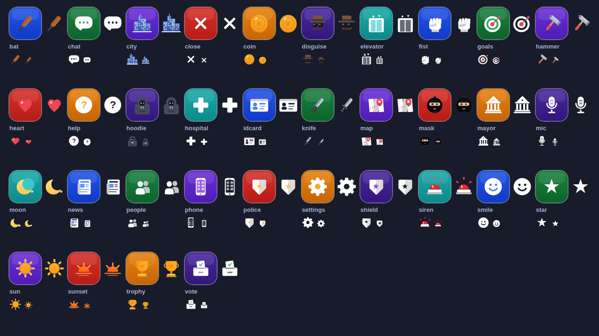

| Welcome screen |
|---|
| 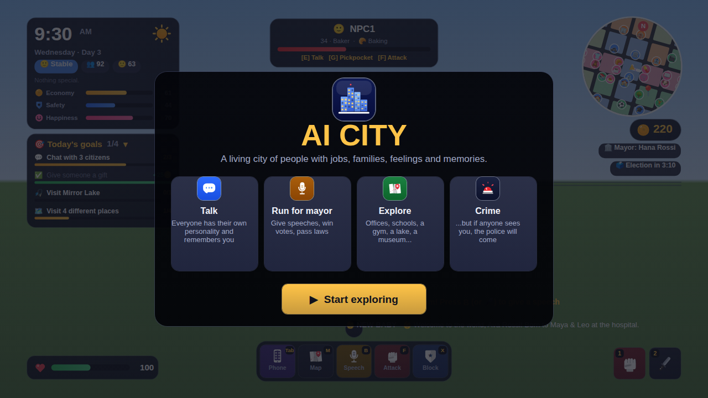 |

*(These previews were drawn from the game's real UI in a test harness. In Roblox, the portraits show the 3D citizen.)*

| Key | |
|---|---|
| Tab | phone (all the apps) |
| Shift | sprint (hold) |
| E | talk / use elevator / order food / treadmill |
| M | map |
| P | people |
| V | vote |
| B | speech |
| N | mayor's desk |
| F | attack (or click with a weapon) |
| X | block (hold) |
| 1–4 | hotbar: 1 = fists, then your weapons |
| G | pickpocket |
| R | rob |
| Q | hide (at trash cans, hedges and bushes) · Space gets out |
| C | wardrobe: put on or take off your hoodie, ski mask or disguise |
| J | clock in at a workplace |
| H | help |
| 1–9 | answer in conversations |
| Esc | close |

Every action is also a button on the action bar for mobile players.

**On a controller:** R2 attack · hold L2 block · click L3 sprint · R1 / L1 switch weapons · D-pad ▲ phone, ▼ map, ◀ help, ▶ wardrobe · X talk / use · Y pickpocket / rob / hide / clock in · B close / back / get out of hiding · A jump. Menus open with a button selected, so you can move with the D-pad and press A.

## How it works

| Script | Where | What it does |
|---|---|---|
| `Main` | ServerScriptService | Builds the map, loads or creates the citizens, starts everything. |
| `MapBuilder` + `MapKit`, `Buildings`, `Interiors`, `Decor`, `Streets`, `Landscape`, `Places` | Modules | The city, its interiors (`Decor` adds the finishing touches to every room) and the "spots" where people stand, sit, work and sleep. |
| `Life` | Modules | Who lives here: families, ages, jobs, schools, personalities, friends, and where each person should be at any hour. Pure logic, no parts. |
| `CityService` | Modules | Clock and calendar, city stats and mood, mayor, elections, speeches, policies, coins, memories, gossip, news, saving, and the remotes. |
| `CitizenService` | Modules | The NPC bodies: walking, elevators, spots, soccer, chatting, greetings, reactions, knockouts, births, growing up. |
| `DialogueService` | Modules | Conversations with players, and citizens' small talk. |
| `CrimeService` | Modules | Fighting (attacks, citizens fighting back), crimes, witnesses, wanted stars, police chases, SWAT, the helicopter, hiding, jail. |
| `CombatService` | Modules | Weapons as tools, the Hardware store shop, blocking, waking up at the hospital, confiscation. |
| `StreetCrimeService` | Modules | Other people's crimes (pickpockets, bag snatchers, robbers, graffiti), police chases, arrests with handcuffs, the jail cell, players catching thieves. |
| `FitnessService`, `FoodService` | Modules | Fitness levels (sprinting XP, gym treadmills) and the food places' menus. |
| `Conversation` | Module | Personalities' voices, follow-up questions and the "let's really talk" answers. |
| `JobService` | Module | Jobs for players: clock-in prompts, shifts, task markers and pay. |
| `Errands` | Module | Turns citizens' plans into chains of tasks with a purpose (shopping trips, mail rounds, patrols...). |
| `Gamepad` | CityClient module | Controller buttons, menu selection, controller hints and rumble. |
| `BrawlService` | Modules | Street fights between citizens: arguments, punches, the crowd, the police, breaking them up. |
| `DisguiseService` | Modules | Hoodies, ski masks and disguise kits: the Clothing store, the wardrobe, how they look on your character, nervous citizens. |
| `PlayerService` | Modules | Elevators, profiles, the directory, finding people. |
| `CitizenLook` | Modules | Outfits, hair, items, faces and sizes. |
| `Config`, `Actions`, `Atmosphere`, `Faces`, `Poses`, `Weapons`, `Disguises`, `Fitness`, `Food` | ReplicatedStorage.Shared | Settings; the list of actions; the sky; drawn faces; the pose and prop library; weapon stats; disguise stats. |
| `CityClient` (+ `UI`, `Icons`, `Hud`, `Panels`, `World`, `Moves`) | StarterPlayerScripts | Everything on screen, and the citizens' body language, faces, nameplates and speech bubbles. |

It's built to stay light on the server:
- **The server only decides where people are and what they're doing.** Each citizen carries this in their `Action`, `Expression` and `Activity` attributes.
- **Each player's own client handles the look.** It plays the poses, adds the props, blinks the faces and turns heads toward you, but only for people near the camera.
- **Nobody walks where nobody can see.** People near a player walk at `WALK_SPEED`, people further out at `TRAVEL_SPEED`. People and waypoints that are far from every player (over 2× `WATCH_RADIUS`) hop along their route instead of walking it, so cross-town trips still fit the day.
- **Crowds don't jam.** Citizens don't collide with each other.
- **Only nearby houses are furnished.** A house is furnished the first time a family moves in.
- **The place uses `StreamingEnabled`,** and citizens stream in whole.

### For your own scripts

```lua
local Modules = game.ServerScriptService.Modules
local map = require(Modules.MapBuilder).Build()          -- builds once, then returns the same map
map.Places.Bakery.Door, map.Places.Bakery.Inside, map.Places.Bakery.Spots
map.Homes[1].Address, map.Route(fromPos, toPos), map.RouteBetween(placeA, placeB)

local CityService = require(Modules.CityService)
CityService.Event.Event:Connect(function(kind, ...)      -- "NewDay", "Born", "Expecting", "GrewUp",
	print(kind, ...)                                     -- "Retired", "Crime", "Speech", "Election",
end)                                                     -- "Policy", "News"
CityService.News("Something happened!")                 -- the news board, ticker and toasts
CityService.AddCoins(player, 50, "🎁 Reward")
CityService.Remember(citizen, player, "helped me", 10, "helped Maria")   -- memories and opinions
```

Set `Config.RUN_CITIZENS = false` if your own scripts spawn citizens; the map and `CityService` still run. To change what's built where, edit `PLAN` in `MapBuilder.lua`: each block (`"i,j"`, the plaza is `"0,0"`) names what goes there.

## Config

Your Config is the base. Every key you had is still there, and these were added:

| Key | What it does |
|---|---|
| `Config.Schools` | The three schools and the ages that go to each. |
| `DAYCARE_AGE` | Toddlers from this age go to daycare while their parents work. |
| 12 new jobs | Middle and high school teachers, coach, daycare worker, museum guide, mail carrier, arcade attendant, cook, programmer, accountant, night janitor, community organizer. |
| 10 new places | Middle School, High School, Daycare, Museum, Post Office, Arcade, Diner, Community Center, Willow Park, Mirror Lake. |
| `SMOOTH_BODIES`, `CITIZEN_BODIES` (optional) | Citizens use the classic Man / Woman body packages; set `SMOOTH_BODIES = false` for blocky bodies, or give your own body part IDs in `CITIZEN_BODIES = { Man = { Torso = ..., LeftArm = ..., RightArm = ..., LeftLeg = ..., RightLeg = ... }, Woman = {...} }`. |
| `WEEKENDS` (optional) | Set to `false` to turn off weekends. |
| `RUN_CITIZENS`, `SAVE_POPULATION` (optional) | Both default to on. |
| `STREET_FIGHTS`, `FIGHT_COOLDOWN` (optional) | Street fights between citizens are on, about one every 140 seconds near a player. |
| `NPC_CRIME`, `NPC_CRIME_COOLDOWN` (optional) | Other people's crimes are on, about one every 110 seconds near a player. |

## Tested

The game was run in a Luau test harness (a small Roblox simulation), and these checks pass:

- **The map:**
  - every job and school has enough spots;
  - every upper floor can be reached;
  - no buildings overlap and nothing sticks into the roads;
  - every place can be walked to.
- **Two full simulated days:**
  - up to 45 people at work at once;
  - kids at the right schools;
  - soccer after school;
  - 160+ speech bubbles;
  - 45 different actions;
  - nobody out walking at 2 AM.
- **A player's session, start to finish:**
  - a speech;
  - a conversation covering every topic, plus a gift and directions;
  - daily goals completing and paying out;
  - a profile card, the directory and the places list;
  - four punches, a knockout, a witness and wanted stars;
  - a police chase, an arrest, jail and release;
  - running out of sight (the police search where they last saw you), hiding in a trash can until the stars fade, and getting found after being seen climbing in;
  - buying weapons, stabbing someone down in two hits, a grumpy citizen fighting back (blocking takes a third of the damage), getting knocked out and waking up at the hospital, hitting another player with a bat, and the police confiscating the weapons at the arrest;
  - six crimes in a row: 2 stars and 3 officers, then 4 stars with SWAT, then 5 stars with 10 police, SWAT and the helicopter;
  - disguises:
    - buying a hoodie, a ski mask and a disguise kit, and wearing a top and a face item together;
    - how hidden each outfit is by day and by night;
    - a masked crime at night that nobody recognized (no notoriety);
    - changing the outfit out of sight and losing the police 3 times faster;
    - a citizen getting nervous about a ski mask at noon;
  - street fights:
    - a fight starting on its own near the player (a grumpy citizen started it);
    - punches landing, a crowd forming, the police being called;
    - the player breaking one up (+20 coins, news) and jumping into another;
    - fights ending with knockouts, people running away, and giving up;
  - other people's crimes:
    - a bag snatching, a pickpocketing, a store robbery and a graffiti tag, each chased down, cuffed and jailed by the police;
    - the player catching a bag snatcher (no stars, +30 coins, taken away by the police);
    - the player's own pocket being picked, then getting the coins back;
    - a street fighter arrested and jailed, and inmates released after their time;
  - food, fitness and moves:
    - ordering at all six food counters, healing and refilling stamina, and energy-drink boosts;
    - leveling up by sprinting (without being able to cheat the XP) and by working out on a treadmill;
    - jabs alternating left and right, and blocking, showing on the character;
  - an elevator ride to floor 9;
  - a vote and an election (and winning it).
- **The client:** every window and every server message, and poses on 20 citizens at once.
- **A controller:** R2 attacks, L2 blocks, the D-pad opens the phone and map with a button selected, B closes them and ends conversations, the first answer is selected in a conversation, and hints switch between keys and controller buttons.
- **Jobs:** a full shift of all six jobs through the real prompts (every task pays, the bonus arrives, the right animations and props play), quitting halfway, and no hiring while wanted.
- **Witnesses:** a hit from behind with nobody around brings no stars; the same victim seeing you face to face does; a bystander across the street seeing a hit from behind does too.
- **Errands:** over a simulated day, citizens pay at tills, deliver mail, patrol, water and rake, restock, serve tables, mop and unpack shopping, and carry briefcases, backpacks, gym bags and shopping bags, with no warnings.
- **Homes:** walking up to an empty house furnishes it (sofa, TV, dining table, kitchen, fridge, bathroom, beds, wardrobe), and on all 115 two-storey houses nothing blocks the way up the stairs.
- **Conversations:** follow-ups after "how's your day" and "what do you do", back to the main questions, all seven "let's really talk" answers, a citizen remembering your gift when asked what they think of you, and 20 personalities with 20 different voices.
- **The bigger map:** 275 buildings with no overlaps and nothing in the roads, and every place reachable (the longest walk is about 2,000 studs).
- **Phones:** the client starts on a touch screen at 844×390 with no errors, and every window fits on screen.
- **Crowds:** with the same people over the same hour, people overlap each other a third as often with steering on, and nobody walks into the player.
- **Interiors:** no part covers a floor except rugs and tiles, and every shop gets its own props without blocking where people stand to work, browse or sit.
